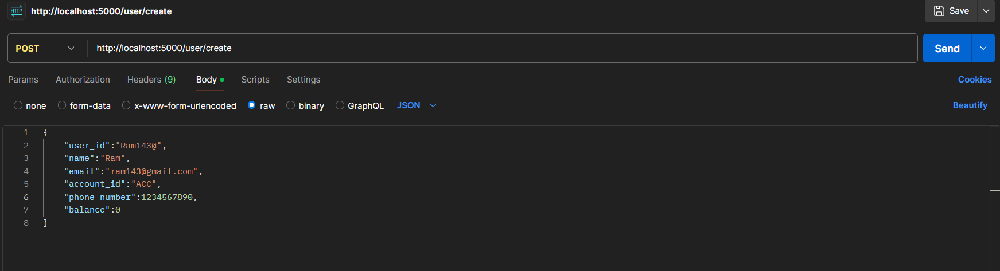
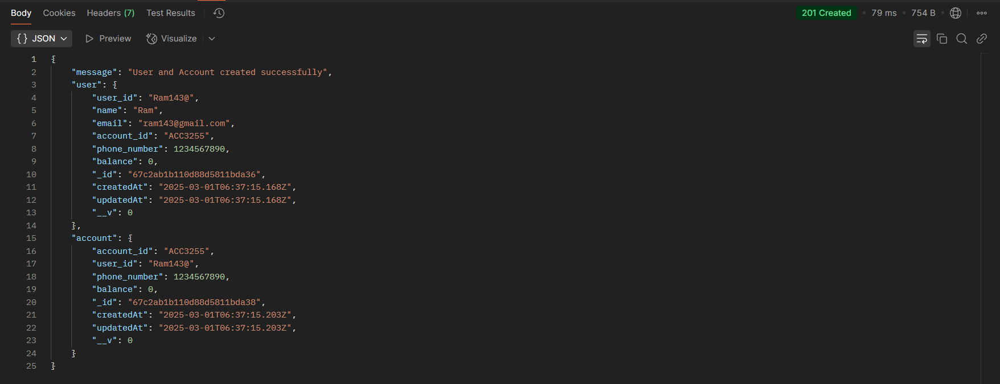
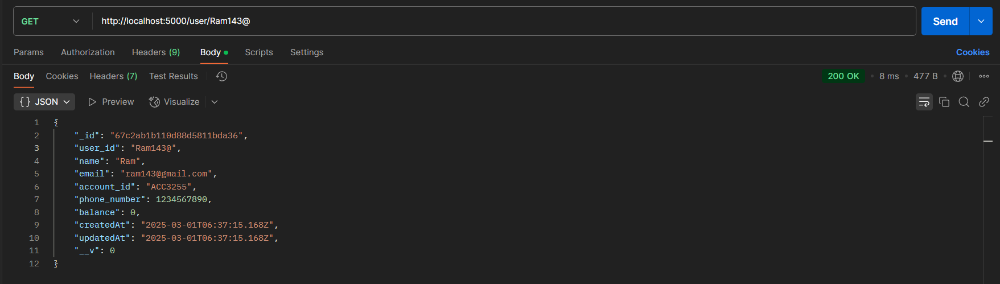
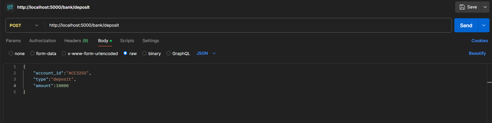
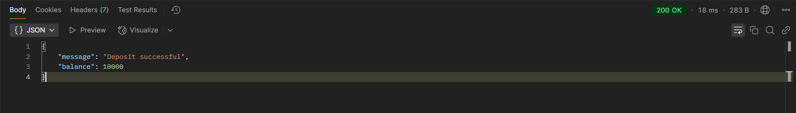
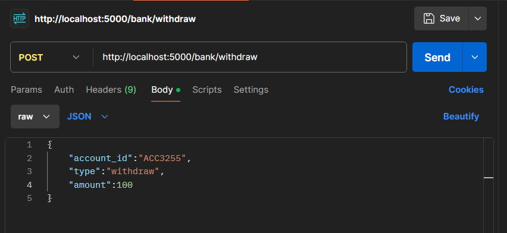
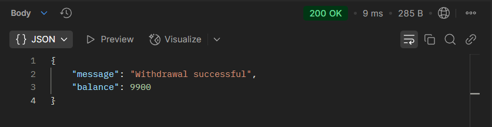
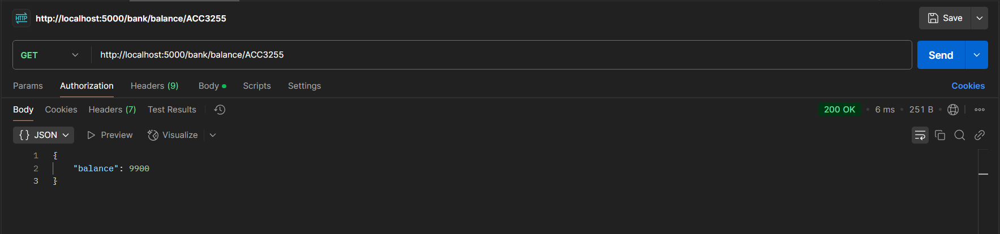

# 🚀 Asset-X Banking API

A secure banking API built with **Node.js, Express, and MongoDB** to handle user accounts, transactions, and balances.

---

## 📌 Features

- Create and manage users and accounts
- Deposit and withdraw funds securely
- Fetch account balances
- Uses MongoDB for data storage

---

## ⚙️ Tech Stack

- Node.js 
- MongoDB
- Express

---
## 🛠️ API Endpoints

### **User Routes**  

#### ** Create a User**  
- **Endpoint:** `POST /user/create`  
- **Description:** Creates a new user with a unique account.
- **Input:** json

- **Output:**

#### ** Get User Details**
- **Endpoint:** `GET /user/:user_id`  
- **Description:**  Fetches details of a user by their ID.

#### ** Bank Deposit **
- **Endpoint:** `POST /bank/deposit`  
- **Description:** Adds money to the user’s account.
- **Input:** json

- **Output:**

#### ** Bank Withdraw **
- **Endpoint:** `POST /bank/Withdraw`  
- **Description:** Deducts money from the user’s account.
- **Input:** json

- **Output:**

#### ** Get Balance**
- **Endpoint:** `GET/bank/bank/balance/:account_id`  
- **Description:** Retrieves the current balance of an account.

## 🔧 Setup & Installation
- Clone the Repository
- **Install Dependencies:** npm install
- **Start the Server:** node index.js
- Create a .env file and add your MongoDB connection string:MONGO_URI=your_mongodb_uri